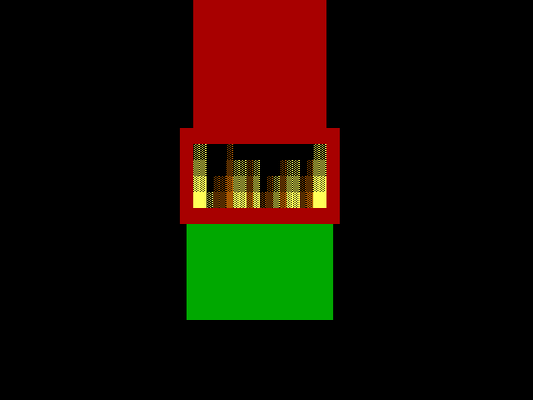

# Animated fireplace on DOS

The holidays are almost here, so I thought it would be fun to create an animated fireplace in DOS. This sample program also shows several tricks with using console mode display with text windows, to draw text in a column.

This is the source code from the [animated fireplace on DOS](https://www.youtube.com/watch?v=k_xjYO2g57E) video on YouTube.
